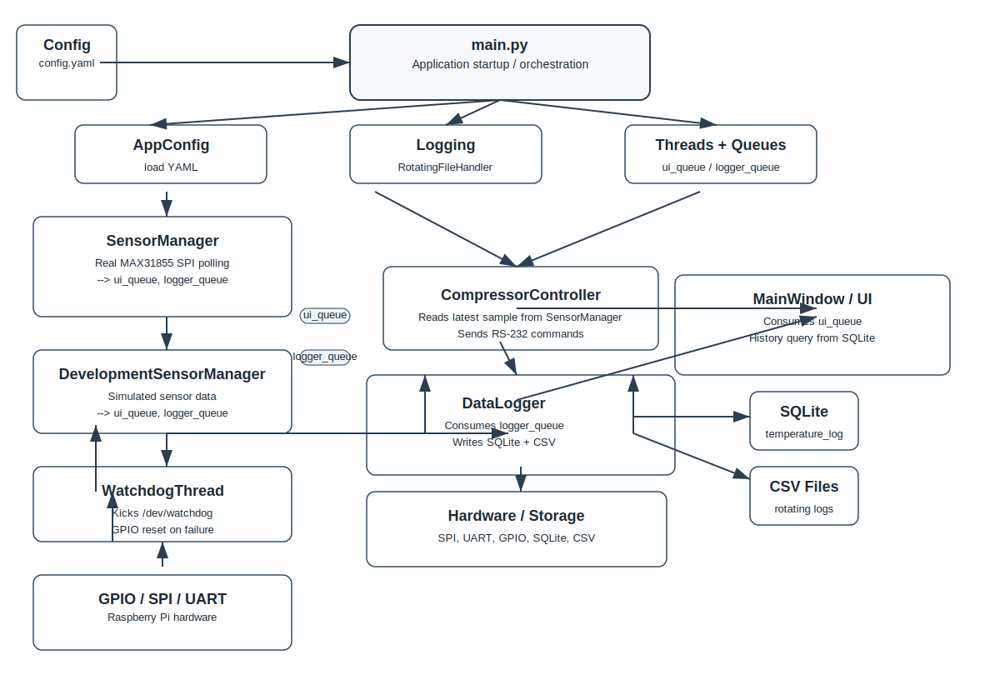

# Spine Cooling Runtime Architecture

This diagram shows the main application architecture for the Spine Cooling Raspberry Pi runtime.

- `main.py` orchestrates startup
- `AppConfig` loads configuration
- `SensorManager` / `DevelopmentSensorManager` publish samples to both UI and logger queues
- `CompressorController` evaluates latest sensor data and sends commands over RS-232
- `DataLogger` writes to SQLite and rotating CSV files
- `MainWindow` displays live charts and queries history from SQLite
- `WatchdogThread` kicks `/dev/watchdog` and manages GPIO reset on failure

