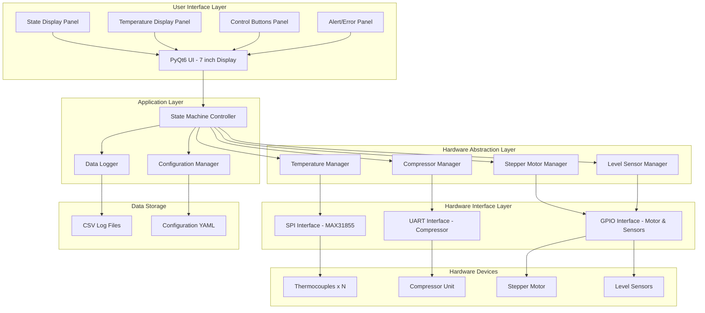
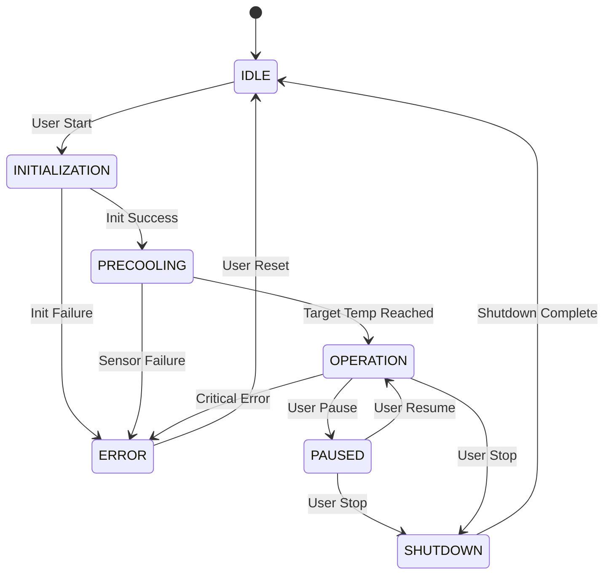
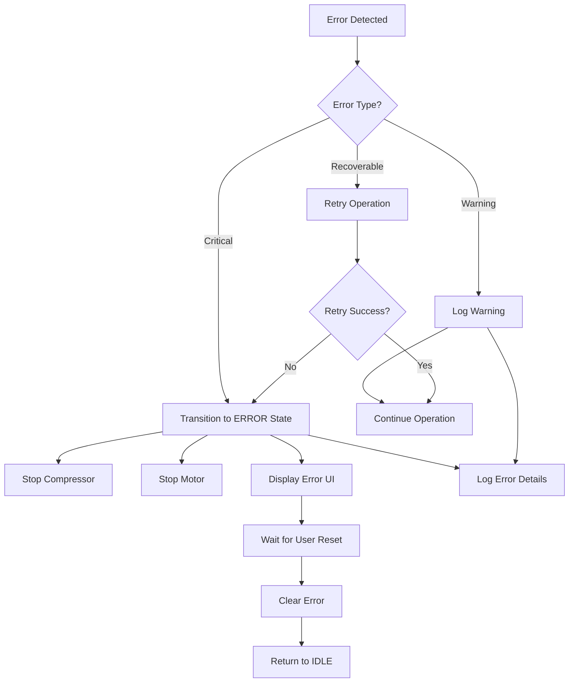

# Medical Device Prototype - System Architecture

## Overview

This document describes the architecture for a medical device prototype running on Raspberry Pi 4 B, designed for spine cooling applications with temperature monitoring, compressor control, and user interface.

## System Architecture Diagram



## State Machine Design

### States

1. **IDLE**: System powered on, waiting for user to start
2. **INITIALIZATION**: System self-check, sensor validation, device initialization
3. **PRECOOLING**: Compressor running to reach target temperature
4. **OPERATION**: Normal operation mode with active cooling
5. **PAUSED**: Operation temporarily suspended by user
6. **SHUTDOWN**: Controlled shutdown sequence
7. **ERROR**: Error condition detected, safe mode activated

### State Transitions



### State Behaviors

| State | Compressor | Motor | UI Display | Data Logging |
|-------|-----------|-------|------------|--------------|
| IDLE | OFF | OFF | Ready message | No |
| INITIALIZATION | OFF | OFF | Checking sensors | No |
| PRECOOLING | ON | OFF | Cooling progress | Yes |
| OPERATION | ON | ON/OFF | Active operation | Yes |
| PAUSED | OFF | OFF | Paused status | Yes |
| SHUTDOWN | OFF | OFF | Shutting down | Yes |
| ERROR | OFF | OFF | Error details | Yes |

## Component Design

### 1. Configuration Manager

**Purpose**: Manage adjustable system parameters

**Configuration Parameters**:
```yaml
hardware:
  uart:
    port: "/dev/ttyAMA0"
    baudrate: 9600
    timeout: 1.0
  
  spi:
    bus: 0
    device: 0
    max_speed_hz: 5000000
  
  gpio:
    stepper_pins:
      step: 17
      direction: 27
      enable: 22
    level_sensors:
      - pin: 23
        name: "Upper Level"
      - pin: 24
        name: "Lower Level"

sensors:
  thermocouples:
    count: 4
    names:
      - "Inlet Temperature"
      - "Outlet Temperature"
      - "Cooling Zone 1"
      - "Cooling Zone 2"
    sample_rate_hz: 1.0

thresholds:
  temperature:
    min_celsius: -5.0
    max_celsius: 45.0
    target_precool_celsius: 10.0
    operation_range:
      min: 8.0
      max: 12.0
  
  timing:
    precool_timeout_seconds: 300
    sensor_read_interval_ms: 1000
    ui_update_interval_ms: 100

compressor:
  commands:
    start: "START\r\n"
    stop: "STOP\r\n"
    status: "STATUS\r\n"
  response_timeout_seconds: 2.0

stepper_motor:
  steps_per_revolution: 200
  max_speed_rpm: 60
  acceleration_steps_per_sec2: 100

logging:
  csv_directory: "data/csv"
  filename_format: "temp_log_%Y%m%d_%H%M%S.csv"
  rotation_size_mb: 10
  fields:
    - timestamp
    - state
    - thermocouple_1
    - thermocouple_2
    - thermocouple_3
    - thermocouple_4
    - compressor_status
    - level_sensor_upper
    - level_sensor_lower
```

### 2. State Machine Controller

**Responsibilities**:
- Manage system state transitions
- Coordinate hardware components
- Handle user commands
- Monitor safety conditions
- Trigger error handling

**Key Methods**:
- `transition_to(new_state)`: Execute state transition
- `handle_user_command(command)`: Process UI commands
- `check_safety_conditions()`: Monitor for error conditions
- `update()`: Main control loop iteration

### 3. Temperature Manager

**Responsibilities**:
- Read multiple MAX31855 thermocouple amplifiers via SPI
- Validate sensor readings
- Detect sensor faults
- Provide temperature data to state machine

**Features**:
- Configurable number of thermocouples
- Fault detection (open circuit, short to ground/VCC)
- Temperature averaging and filtering
- Out-of-range detection

### 4. Compressor Manager

**Responsibilities**:
- Control compressor via UART commands
- Monitor compressor status
- Handle communication errors
- Provide compressor state to system

**Communication Protocol**:
- Configurable baud rate
- ASCII command format (adjustable)
- Response parsing
- Timeout handling

### 5. Stepper Motor Manager

**Responsibilities**:
- Control stepper motor via GPIO
- Implement acceleration/deceleration profiles
- Position tracking
- Emergency stop capability

**Control Features**:
- Step/direction interface
- Enable/disable control
- Speed and acceleration limits
- Position feedback

### 6. Level Sensor Manager

**Responsibilities**:
- Read digital level sensors via GPIO
- Debounce sensor inputs
- Provide level status to state machine
- Trigger alerts on level changes

### 7. Data Logger

**Responsibilities**:
- Log temperature and system data to CSV files
- Implement file rotation based on size
- Timestamp all entries
- Handle disk space management

**CSV Format**:
```csv
timestamp,state,temp_1,temp_2,temp_3,temp_4,compressor,level_upper,level_lower
2026-04-17 14:30:00.123,OPERATION,10.5,11.2,10.8,11.0,ON,1,1
```

### 8. PyQt6 User Interface

**Layout Design** (7-inch display, 800x480 resolution):

```
┌─────────────────────────────────────────────────────┐
│  Medical Device Control - [CURRENT STATE]           │
├─────────────────────────────────────────────────────┤
│                                                      │
│  ┌──────────────────────────────────────────────┐  │
│  │  Temperature Readings                        │  │
│  │  ┌────────────┐  ┌────────────┐             │  │
│  │  │ Inlet      │  │ Outlet     │             │  │
│  │  │ 10.5 °C    │  │ 11.2 °C    │             │  │
│  │  └────────────┘  └────────────┘             │  │
│  │  ┌────────────┐  ┌────────────┐             │  │
│  │  │ Zone 1     │  │ Zone 2     │             │  │
│  │  │ 10.8 °C    │  │ 11.0 °C    │             │  │
│  │  └────────────┘  └────────────┘             │  │
│  └──────────────────────────────────────────────┘  │
│                                                      │
│  ┌──────────────────────────────────────────────┐  │
│  │  System Status                               │  │
│  │  Compressor: ON  │  Motor: IDLE              │  │
│  │  Upper Level: OK │  Lower Level: OK          │  │
│  └──────────────────────────────────────────────┘  │
│                                                      │
│  ┌──────────────────────────────────────────────┐  │
│  │  [START]  [PAUSE]  [STOP]  [RESET]          │  │
│  └──────────────────────────────────────────────┘  │
│                                                      │
│  Status: System operating normally                  │
└─────────────────────────────────────────────────────┘
```

**UI Features**:
- Real-time temperature display with color coding
- State indicator with visual feedback
- Large, touch-friendly buttons
- Status message area
- Alert/error popup dialogs
- Configuration access (password protected)

## Project Directory Structure

```
spine-cooling-runtime/
├── config/
│   ├── default_config.yaml
│   └── hardware_pins.yaml
├── src/
│   ├── __init__.py
│   ├── main.py
│   ├── state_machine/
│   │   ├── __init__.py
│   │   ├── controller.py
│   │   ├── states.py
│   │   └── transitions.py
│   ├── hardware/
│   │   ├── __init__.py
│   │   ├── temperature.py
│   │   ├── compressor.py
│   │   ├── stepper.py
│   │   └── level_sensors.py
│   ├── ui/
│   │   ├── __init__.py
│   │   ├── main_window.py
│   │   ├── widgets/
│   │   │   ├── __init__.py
│   │   │   ├── temperature_panel.py
│   │   │   ├── status_panel.py
│   │   │   └── control_panel.py
│   │   └── dialogs/
│   │       ├── __init__.py
│   │       ├── error_dialog.py
│   │       └── config_dialog.py
│   ├── data/
│   │   ├── __init__.py
│   │   ├── logger.py
│   │   └── config_manager.py
│   └── utils/
│       ├── __init__.py
│       ├── gpio_manager.py
│       └── validators.py
├── data/
│   └── csv/
├── tests/
│   ├── __init__.py
│   ├── test_state_machine.py
│   ├── test_hardware.py
│   └── test_logger.py
├── docs/
│   ├── ARCHITECTURE.md
│   ├── HARDWARE_SETUP.md
│   ├── USER_MANUAL.md
│   └── API_REFERENCE.md
├── scripts/
│   ├── install.sh
│   ├── start_service.sh
│   └── stop_service.sh
├── requirements.txt
├── setup.py
└── README.md
```

## Hardware Connections

### Raspberry Pi 4 B Pin Assignments

**SPI (Thermocouples - MAX31855)**:
- GPIO 9 (MISO) - Data from MAX31855
- GPIO 10 (MOSI) - Not used for MAX31855
- GPIO 11 (SCLK) - Clock
- GPIO 8 (CE0) - Chip Select for first sensor
- Additional CS pins for multiple sensors

**UART (Compressor)**:
- GPIO 14 (TXD) - Transmit to compressor
- GPIO 15 (RXD) - Receive from compressor

**GPIO (Stepper Motor)**:
- GPIO 17 - Step pulse
- GPIO 27 - Direction
- GPIO 22 - Enable

**GPIO (Level Sensors)**:
- GPIO 23 - Upper level sensor
- GPIO 24 - Lower level sensor

**Power**:
- 5V and GND pins for powering sensors
- External power supply for motor and compressor

## Safety Features

1. **Temperature Monitoring**: Continuous validation of sensor readings
2. **Watchdog Timer**: Automatic error state if main loop hangs
3. **Emergency Stop**: Immediate shutdown of all devices
4. **Sensor Fault Detection**: Open circuit and short circuit detection
5. **Communication Timeout**: Error state if compressor doesn't respond
6. **Level Sensor Monitoring**: Alert on abnormal fluid levels
7. **Data Logging**: Complete audit trail of all operations

## Error Handling Strategy

### Error Categories

1. **Critical Errors** (immediate shutdown):
   - Temperature out of safe range
   - Sensor failure
   - Compressor communication failure
   - Multiple sensor faults

2. **Warning Conditions** (logged, operation continues):
   - Single sensor reading anomaly
   - Slow temperature response
   - Level sensor fluctuation

3. **Recoverable Errors** (automatic retry):
   - Temporary communication timeout
   - Transient sensor reading error

### Error Response Flow



## Performance Requirements

- **Temperature Sampling Rate**: 1 Hz (configurable)
- **UI Update Rate**: 10 Hz for smooth display
- **Data Logging Rate**: 1 Hz during operation
- **State Machine Loop**: 10 Hz minimum
- **Compressor Response Time**: < 2 seconds
- **Emergency Stop Response**: < 100 ms

## Testing Strategy

1. **Unit Tests**: Individual component testing
2. **Integration Tests**: Hardware interface testing
3. **State Machine Tests**: Transition validation
4. **UI Tests**: User interaction simulation
5. **Safety Tests**: Error condition validation
6. **Performance Tests**: Timing and responsiveness
7. **Hardware-in-Loop Tests**: Full system validation

## Deployment

1. **Installation Script**: Automated setup on Raspberry Pi
2. **Systemd Service**: Auto-start on boot
3. **Configuration Validation**: Pre-flight checks
4. **Logging Setup**: Automatic log directory creation
5. **Backup Strategy**: Configuration and data backup

## Future Enhancements

1. Remote monitoring via web interface
2. Database integration (SQLite/PostgreSQL)
3. Advanced data analytics and visualization
4. Predictive maintenance alerts
5. Multi-device synchronization
6. Cloud data backup
7. Mobile app integration