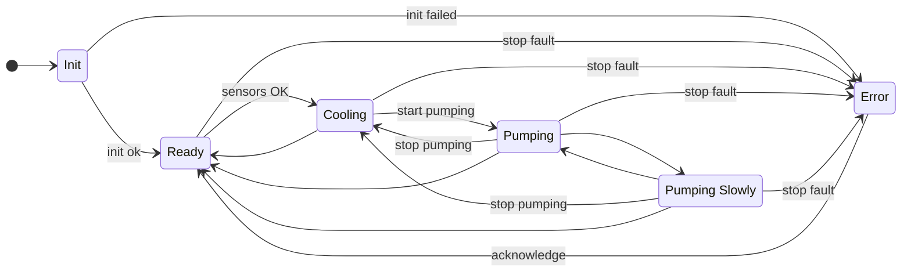

```mermaid
stateDiagram-v2
    direction LR
    [*] --> Init
    Init --> Ready: init ok
    Init --> Error: init failed
    Ready --> Cooling: sensors OK
    Ready --> Error: stop fault
    Cooling --> Pumping: start pumping
    Cooling --> Ready
    Cooling --> Error: stop fault
    Pumping --> PumpingSlowly
    Pumping --> Cooling: stop pumping
    Pumping --> Ready
    Pumping --> Error: stop fault
    PumpingSlowly --> Pumping
    PumpingSlowly --> Cooling: stop pumping
    PumpingSlowly --> Ready
    PumpingSlowly --> Error: stop fault
    Error --> Ready: acknowledge

    state "Pumping Slowly" as PumpingSlowly
```
